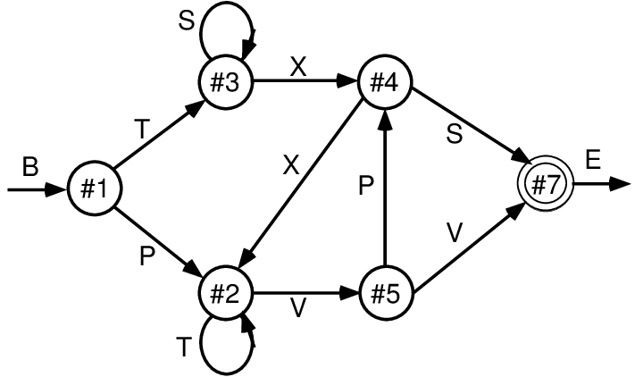
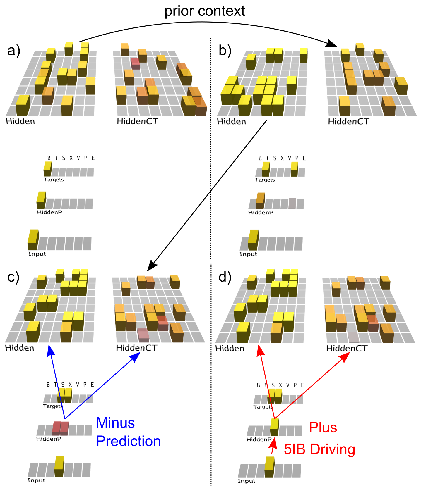

This example illustrates and tests the predictive learning abilities of the `deep` leabra biologically-based model. It uses a classical test of sequence learning [Reber, 1967; Cleeremans & McClelland, 1991](#references) that was explored using simple recurrent networks (SRNs) [Elman, 1990; Jordan, 1989](#references).  As shown in Figure 1, sequences were generated according to a finite state automaton (FSA) grammar, as used in implicit sequence learning experiments by Reber (1967).  Each node has a 50% random branching to two different other nodes, and the labels generated by node transitions are ambiguous (except for the B=begin and E=end states).  Thus, many iterations through the grammar are required to infer the systematic underlying grammar, and it is actually a reasonably challenging task for SRNs, and people, to learn, providing an important validation of the power of these predictive learning mechanisms.

**Figure 1:** Finite state automaton (FSA) grammar used in implicit sequential learning exerpiments (Reber, 1967) and in early simple recurrent networks (SRNs) (Cleeremans \& McClelland, 1991).  It generates a sequence of letters according to the link transitioned between state nodes, with a 50\% random choice for each node of which outgoing link to follow.  Each letter (except for the B=begin and E=end) appears at 2 different points in the grammar, making them fully ambiguous.  This combination of randomness and ambiguity makes it challenging for a learning system to infer the true underlying nature of the grammar.

**Figure 2:** Predictive learning model applied to the FSA grammar shown in previous figure, showing the prediction state (end of the *minus* phase, or the first 75 msec of each alpha cycle) for the first 3 steps of a sequence, after having learned the grammar, followed by the plus phase after the third step.  The `Input` layer provides the 5IB drivers for the corresponding `HiddenP` pulvinar layer, and the `Targets` layer is purely for display, showing the two valid possible labels that could have been predicted.  The model's prediction is scored as accurate if either or both targets are activated.  Computationally, the model is similar to the SRN, where the `CT` layer that drives the prediction over the pulvinar encodes the previous time step (alpha cycle) activation state, due to the phasic bursting of the 5IB neurons that drive CT updating.  Note how the CT layer in b) reflects the Hidden activation state in a), and likewise for c) reflecting b) -- this is evident because we're using one-to-one connectivity between Hidden and HiddenCT layers (which works well in general, along with full lateral connectivity within the CT layer).  Thus, even though the correct answer is always present on the Input layer for each step, the CT layer is nevertheless attempting to predict this Input based on the information from the prior time step.  **a)** In the first step, the B label is unambiguous and easily predicted (based on prior E context). **b)** In the 2nd step, the network correctly guesses that the T label will come next, but there is a faint activation of the other P alternative, which is also activated sometimes based on prior learning history and associated minor weight tweaks.  **c)** In the 3rd step, both S and X are equally predicted.  **d)** In the *plus* phase for this trial, only the X present in the Input  drives HiddenP activations, and the projections from pulvinar back to the cortex convey both the minus-phase prediction and plus-phase actual input.  You can see one neuron visibly changes is activation as a result (and all neurons experience much smaller changes), and learning in all these cortical (Hidden) layer neurons is a function of their local temporal difference between minus and plus phases.

The model (Figure 2) required around 20 epochs of 25 sequences through the grammar to learn it to the point of making no prediction errors for 5 epochs in a row, to guarantee that it had completely learned it.  A few steps through a sequence are shown in the figure, illustrating how the CT context layer, which drives the P pulvinar layer prediction, represents the information present on the *previous* alpha cycle time step.  Thus, the network is attempting to predict the actual Input state, which then drives the pulvinar plus phase activation at the end of each alpha cycle, as shown in the last panel.  On each trial, the difference between plus and minus phases locally over each cortical neuron drives its synaptic weight changes, which accumulate over trials to accurately learn to predict the sequences to the extent possible given their probabilistic nature.

# References

* Cleeremans, A., & McClelland, J. L. (1991). Learning the structure of event sequences. Journal of Experimental Psychology: General, 120, 235–253.

* Elman, J. L. (1990). Finding structure in time. Cognitive Science, 14(2), 179–211.

* Jordan, M. I. (1989). Serial Order: A Parallel, Distributed Processing Approach. In J. L. Elman & D. E. Rumelhart (Eds.), Advances in Connectionist Theory: Speech. Hillsdale, NJ: Lawrence Erlbaum Associates.

* Reber, A. S. (1967). Implicit Learning of Artificial Grammars. Journal of Verbal Learning and
Verbal Behavior, 6, 855–863.

