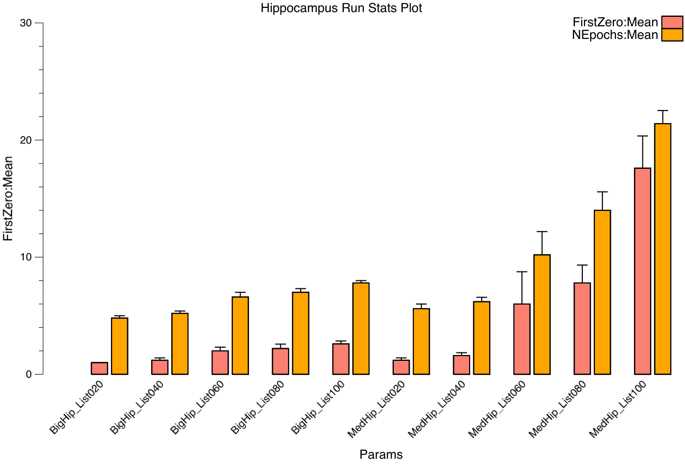
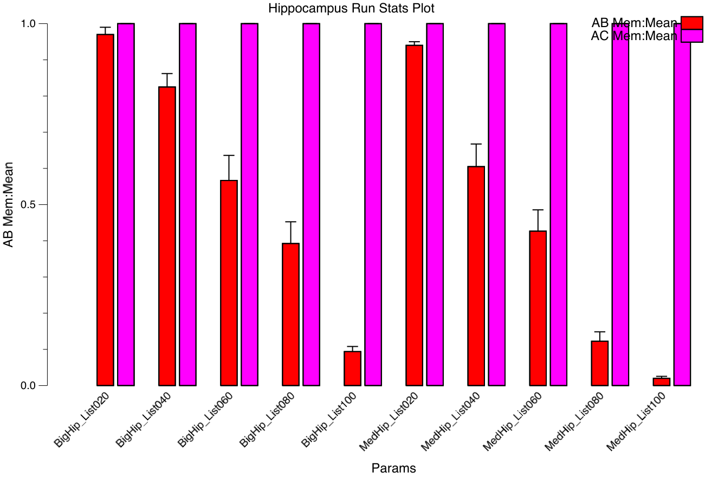
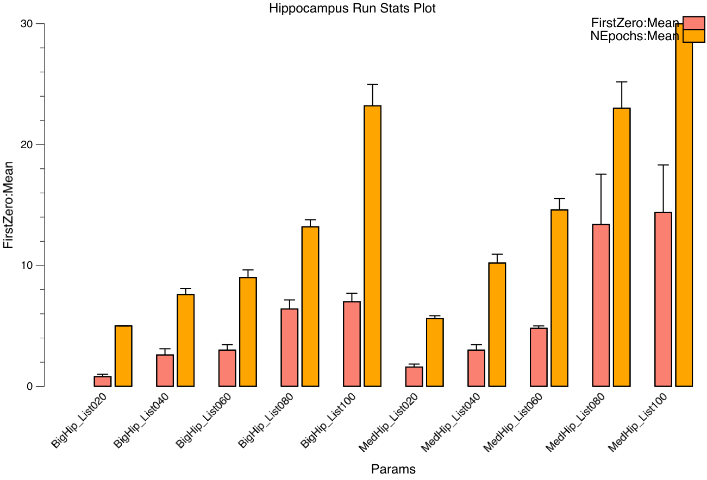
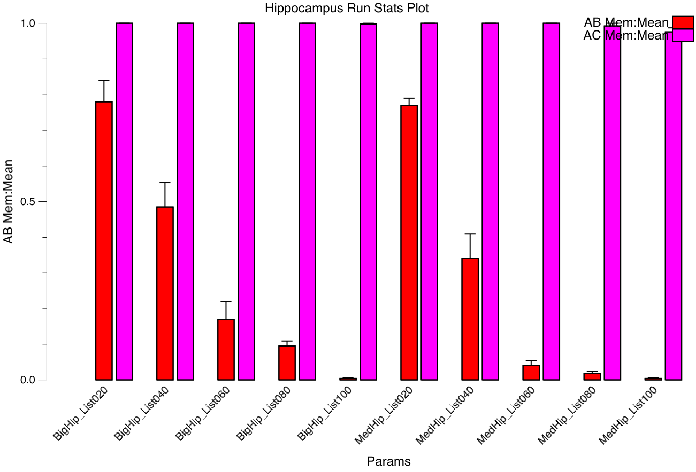

This project supports testing of the hippocampus model, systematically varying different parameters (number of patterns, sizes of different layers, etc), and recording results.

It is both for optimizing parameters and also testing new learning ideas in the hippocampus.

# Best Params for AB-AC, Jan 2021

This is the third pass of parameter optimization, starting from original params inherited from C++ emergent `hip` model, and used in the Comp Cog Neuro textbook, etc.

Dramatic improvements in learning performance were achieved by optimizing the following parameters and adding the following mechanisms:

## Error-driven CA3

Modified `AlphaCyc` to reduce the strength of DG -> CA3 mossy inputs for the first quarter, then increase back to regular strength in Q2 onward.  This creates a minus phase state in CA3 in ActQ1, where it is driven primarily / exclusively by its ECin -> CA3 inputs.  By contrasting with final ActP state, this drives std error-driven learning in all the CA3 projections.

The best params were a WtScale.Rel = 4 for mossy inputs, which is reduced to 0 during Q1, by setting MossyDel=4.  This is in contrast to the Rel = 8 used in original params.

## Strong ECin -> DG learning

ECin -> DG is playing perhaps the strongest role in learning overall, and benefits from a high, fast learning rate, with a very low "SAvgCor" correction factor, meaning that it is really trying to turn off all other units that were not active.  In effect, it is stamping-in a specific pattern for each DG unit, and potentially separating the units further through this strong Hebbian learning which, using the CPCA mode, is turning off inactive inputs.  This ability to turn off inactive inputs also seems to be important for CA3 -> CA1, which works better with CPCA than BCM hebbian.

However, learning in the DG -> CA3 pathway (mossies) is definitely bad.  My interpretation is that you want the CA3 neurons to be able to participate in many different "DG coded" memories, so having CA3 be biased toward any specific subset of DG units is not good, but the DG units themselves are really very specific.

## Reduced DG on Test

Decreasing the DG -> CA3 input during test significantly improves performance overall -- setting MossyDelTest = 3 was best (going all the way to 4 was significantly worse).  This allows the EC -> CA3 pathway to dominate more during testing, supporting more of a pattern-completion dynamic.  This is also closer to what the network experiences during error-driven learning.

## Somewhat sparser mossy inputs

Reducing MossyPCon = .02 instead of .05 was better, but not further.

## Adding BCM Hebbian to EC <-> CA1

The standard Leabra BCM hebbian learning works better than the hip.CHLPrjn CPCA Hebbian learning.

## Performance

The graphs below show number of epochs to get to 100% perfect performance, for the first AB list (First Zero) and both AB and AC lists (NEpochs), and also for the memory performance at the end of training, showing how much of the AB list is still remembered after full training on the AC list.  The new params show robust learning up to list sizes of 100 *each* for AB, AC lists, in the medium sized network, although the AB items are almost completely interfered away after learning the AC list.  In comparison, the original params had slower learning and poorer AB memory.

All models have 7x7 EC pools with A, B/C item pools and 4 additional Context pools that differentiate the AB / AC lists.  The `SmallHip` has 20x20 = 400 CA3, DG = 5x = 2000, and 10x10 = 100 CA1 pools (i.e., original textbook model size); `MedHip` has 30x30 = 900 CA3, DG = 5x = 4500, and 15x15 = 225 CA1 pools; `BigHip` has 40x40 = 1600 CA3, DG = 5x = 8000, and 20x20 = 400 CA1 pools.

### Current best params from 1/2021, list sizes 20-100

### Updated original params runned in 1/2021, list sizes 20-100

