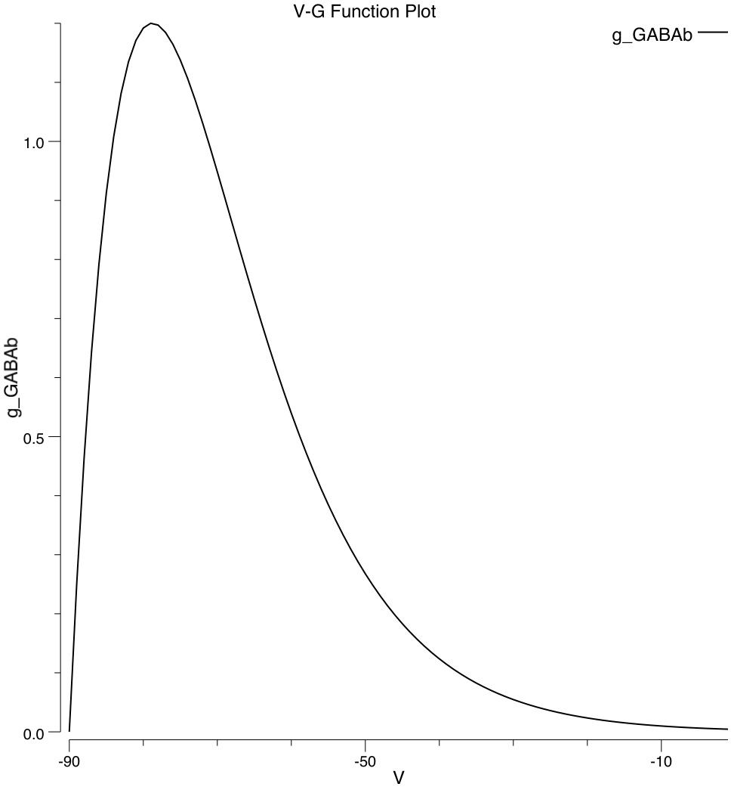
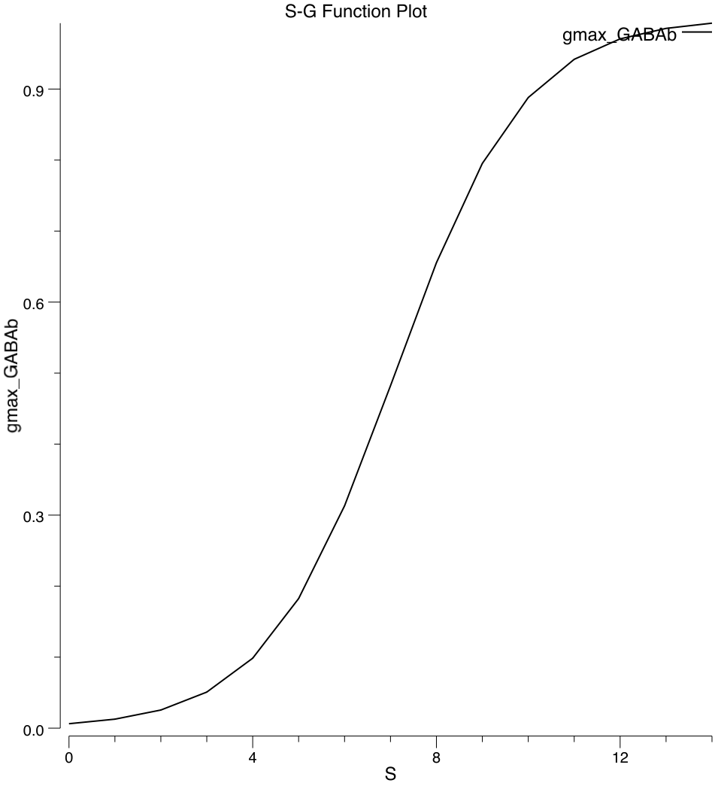
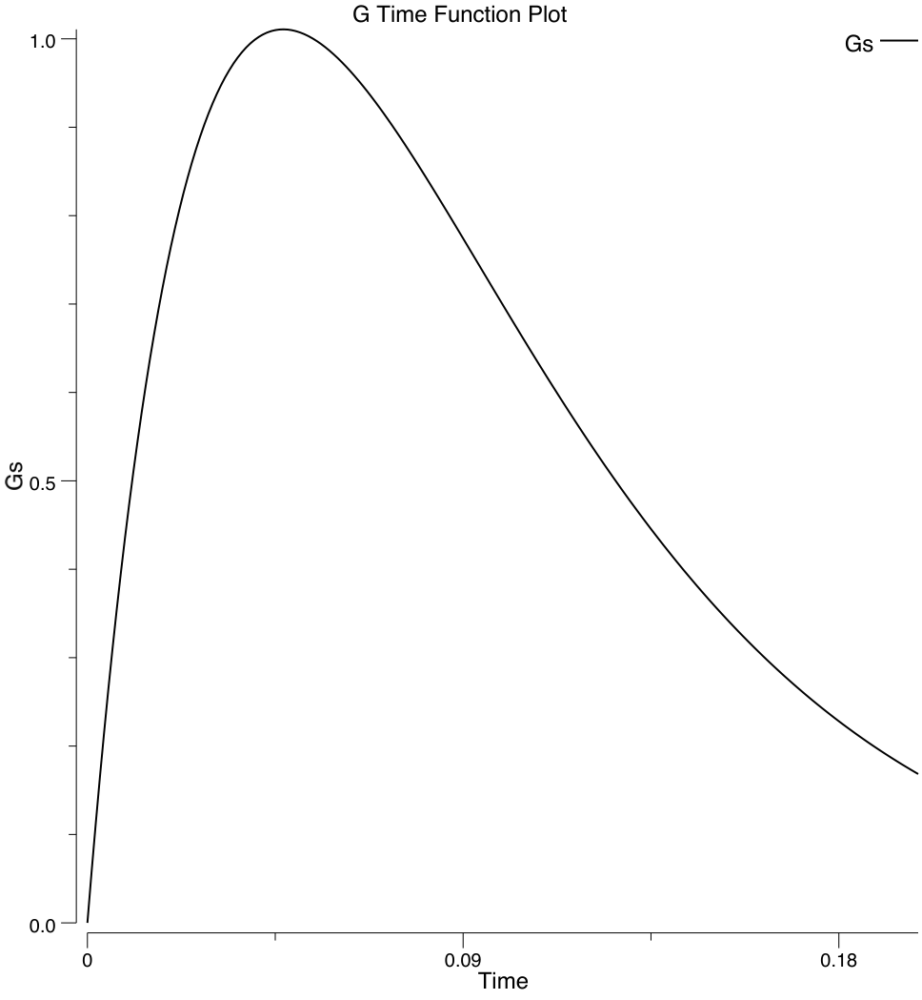
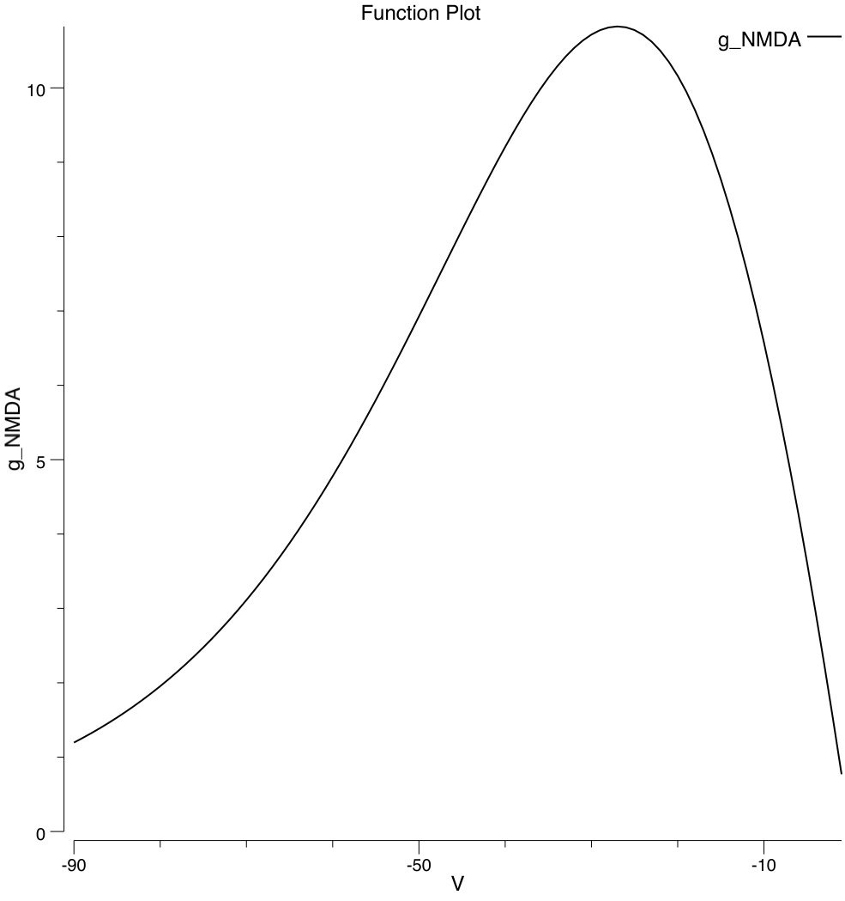

# Glong: longer time-scale conductances from GABA-B / GIRK and NMDA receptors

This package implements two complementary conductances, GABA-B / GIRK and NMDA, that have relatively long time constants (on the order of 100-200 msec) and thus drive these longer-scale dynamics in neurons, beyond the basic AMPA and GABA-A channels with short ~10 msec time constants.  In addition to their longer time constants, these neurons have interesting mirror-image rectification properties (voltage dependencies), inward and outward, which are a critical part of their function (Sanders et al, 2013).

# GABA-B / GIRK

GABA-B is an inhibitory channel activated by the usual GABA inhibitory neurotransmitter, which is coupled to the GIRK *G-protein coupled inwardly rectifying potassium (K) channel*.  It is ubiquitous in the brain, and is likely essential for basic neural function (especially in spiking networks from a computational perspective).  The inward rectification is caused by a Mg+ ion block *from the inside* of the neuron, which means that these channels are most open when the neuron is hyperpolarized (inactive), and thus it serves to *keep inactive neurons inactive*.

In standard Leabra rate-code neurons using FFFB inhibition, the continuous nature of the GABA-A type inhibition serves this function already, so these GABA-B channels have not been as important, but whenever a discrete spiking function has been used along with FFFB inhibition or direct interneuron inhibition, there is a strong tendency for every neuron to fire at some point, in a rolling fashion, because neurons that are initially inhibited during the first round of firing can just pop back up once that initial wave of associated GABA-A inhibition passes.  This is especially problematic for untrained networks where excitatory connections are not well differentiated, and neurons are receiving very similar levels of excitatory input.  In this case, learning does not have the ability to further differentiate the neurons, and does not work effectively.

# NMDA

NMDA is predominantly important for learning in most parts of the brain, but in frontal areas especially, a particular type of NMDA receptor drives sustained active maintenance, by driving sustained excitatory voltage-gated conductances (Goldman-Rakic, 1995; Lisman et al, 1998; Brunel & Wang, 2001).  The well-known external Mg+ ion block of NMDA channels, which is essential for its Hebbian character in learning, also has the beneficial effect of *keeping active neurons active* by virtue of causing an outward rectification that is the mirror-image of the GIRK inward rectification, with the complementary functional effect.  The Brunel & Wang (2001) model is widely used in many other active maintenance / working memory models.

Sanders et al, 2013 emphasize the "perfect couple" nature of the complementary bistability of GABA-B and NMDA, and show that it produces a more robust active maintenance dynamic in frontal cortical circuits.

We are using both NMDA and GABA-B to support robust active maintenance but also the ability to clear out previously-maintained representations, as a result of the GABA-B sustained inhibition.

# Implementation

## Spiking effects on Vm: Backpropagating Action Potentials

Spikes in the soma of a neuron also drive backpropagating action potentials back into the dendrites, which increases the overall membrane potential there above what is produced by the raw synaptic inputs.  In our rate code models, we simulate these effects by adding a proportion of the rate code activation value to the `Vm` value.  Also note that this `Vm` value is an equilibrium Vm that is not reset back to rest after each spike, so it is itself perhaps a bit elevated as a result.

## GABA-B

The GABA-B / GIRK dynamics are based on a combination of Sanders et al, 2013 and Thomson & Destexhe, 1999 (which was major source for Sanders et al, 2013).

T&D found a sigmoidal logistic function described the maximum conductance as a function of GABA spikes, which saturates after about 10 spikes, and a conductance time course that is fit by a 4th-order function similar to the Hodgkin Huxley equations, with a peak at about 60 msec and a total duration envelope of around 200 msec.  Sanders et al implemented these dynamics directly and describe the result as such:

> These equations give a latency of GABAB-activated KIR current of 􏰅10 ms, time to peak of 􏰅50 ms, and a decay time constant of 􏰅80 ms as described by Thomson and Destexhe (1999). A slow time constant for GABA removal was chosen because much of the GABAB response is mediated by extrasynaptic receptors (Kohl and Paulsen, 2010) and because the time constant for GABA decline at extracellular sites appears to be much slower than at synaptic sites.

We take a simpler approach which is to just use a bi-exponential function to simulate the time course, using 45 and 50 msec time constants.

See `gabab_plot` subdirectory for program that generates these plots:



**V-G plot for GABA-B / GIRK** from Sanders et al, 2013.



**Spike-G sigmoid plot for GABA-B / GIRK** from Thomson & Destexhe (1999)



**Bi-exponential time course with 45msec rise and 50msec decay** fitting to results from Thomson & Destexhe (1999)

## NMDA

The NMDA code uses the exponential function from Brunel & Wang (2001), which is very similar in shape to the Sanders et al, 2013 curve, to compute the voltage dependency of the current:

```Go
	vbio := v*100 - 100
	return 1 / (1 + 0.28*math32.Exp(-0.062*vbio))
```   

where v is the normalized Vm value from the Leabra rate code equations -- `vbio` converts it into biological units.

See the `nmda_plot` directory for a program that plots this function, which looks like this (in terms of net conductance also taking into account the driving potential, which adds an `(E - v)` term in the numerator).



**V-G plot for NMDA** from Brunel & Wang (2001)


